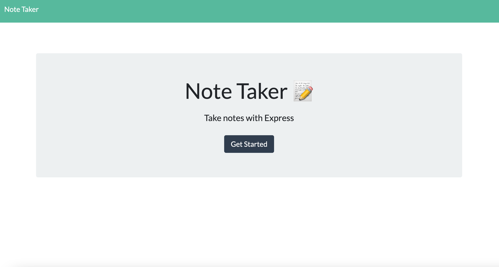

<h1 align="center"> Note Taker 👋</h1> 
 
## Description 

A simple web application that allows users to write, save, and delete notes. The goal of this project was to take an existing front end application, and create a server using express and connect the functionality of the web page with a database(.json). This app is deployed with heroku. Click below on the deployed site.
 

[Depoloyed Site](https://lit-peak-34105.herokuapp.com/)

 

    

## Table of Contents

* [Description](#Description)
* [Installation](#Installation)
* [Usage](#Usage)
* [Credits](#Credits)
* [License](#License)
* [Questions](#Questions)
    
## Installation 

To install necessary dependencies (uniqid, path, fs, express), run the following command:  
`
npm i
`
## Usage 

- When you are on the start page, click get started button. 
- Click on right hand section with the placeholder text `Note Title` and `Note Text` to begin typing a new note. Don't forget a title. As you type you will see a `Save Icon` appear in the upper left. Once finished with your note, click this icon to save your note to the database.
- If notes have been created before, they will be desplayed on the left hand column.
- Click on any of the previously created notes on the left hand column, they will display the entire notes content on the right hand column.
- Click the `Red Trashcan Icon` next to a note, and it will permanently delete the note.
- When viewing an existing note, click the `Pencil Icon` in the top right in order to be able to create another new note.

🚀 Demo:

## License

Copyright © Danielle Orley 

licensed under MIT

## Questions 

If you have any questions please see contact information below.  

My GitHub Username: [dorley1993](http://github.com/dorley1993)